# Module_11_challenge
### Submission Date: May 10,2023

## Step 1: Find unusual patterns in hourly Google search traffic

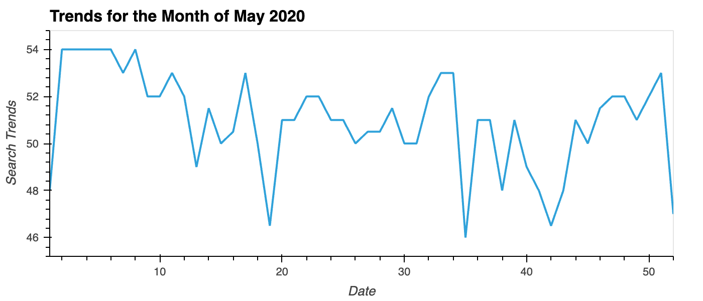

**Do any unusual patterns exist?**

The search trends during May 2020, starts of with a high search trend value at the beginning of the day. Then graudually falls to a single digital search trends value by the time range of 8:00:00 - 10:00:00. The search trend value then increases to a higher value by the end of the day. This pattern repeats through the rest of the month for each day, creating a bouncy sideways trend pattern.

**Did the Google search traffic increase during the month that MercadoLibre released its financial results?**

The total monthly search traffic for May 2020 is: 38181
The total monthly median search traffic across all months is: 35172.5
The Google search traffic increased by 3008.5 during May 2020 when MercadoLibre released its financial results.

## Step 2: Mine the search traffic data for seasonality

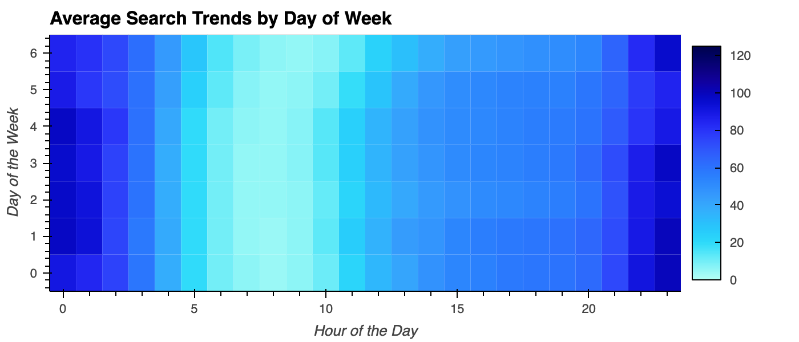

**Does any day-of-week effect that you observe concentrate in just a few hours of that day?**

The search concentration on days 5 and 6 is greater then the concentration on days 0 to 4 during the 6th hour. This change in concentration shifts the heatmap concentration for days 5 and 6 for the remainder of the day. The search concentration is more saturated before the 3 hour window and after the 20 hour window.

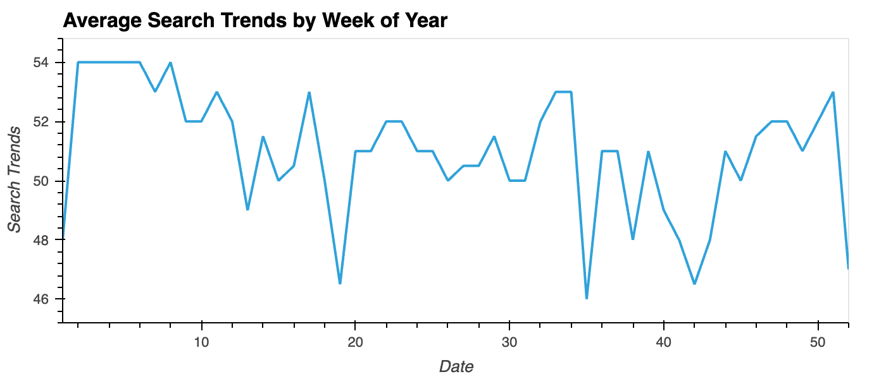

**Does the search traffic tend to increase during the winter holiday period (weeks 40 through 52)?**

The search trend during the winter holiday period (Weeks 40-52) increases until the week 51, excluding the small drop from weeks 40-42. The trend drastically drops down to a search trend value of 47 for week 52, one of the lowest points throughout the year.

## Step 3: Relate the search traffic to stock price patterns

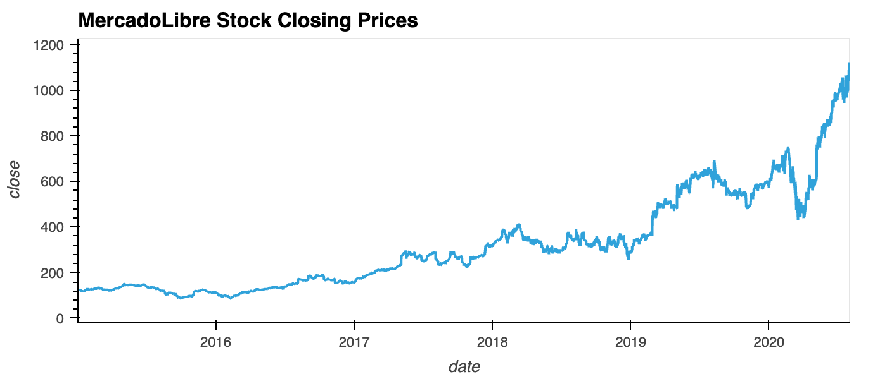

.png)

.png)

**Do both time series indicate a common trend that’s consistent with this narrative?**

Both time series indicate a common trend throughout the period of January - June 2020. During the pandemic both time series trends had a downward drop from 02/25/2020 to 03/11/2020 creating a bear market for MercadoLibre. The introduction of new customers and revence in the e-commerce industry allowed the serach trends to recover. The stock market continued on a downward trend till 04/03/2020. When the increase in e-commerce revenue started affecting the market, MercadoLibre's closing prices started increasing as the search trend had.

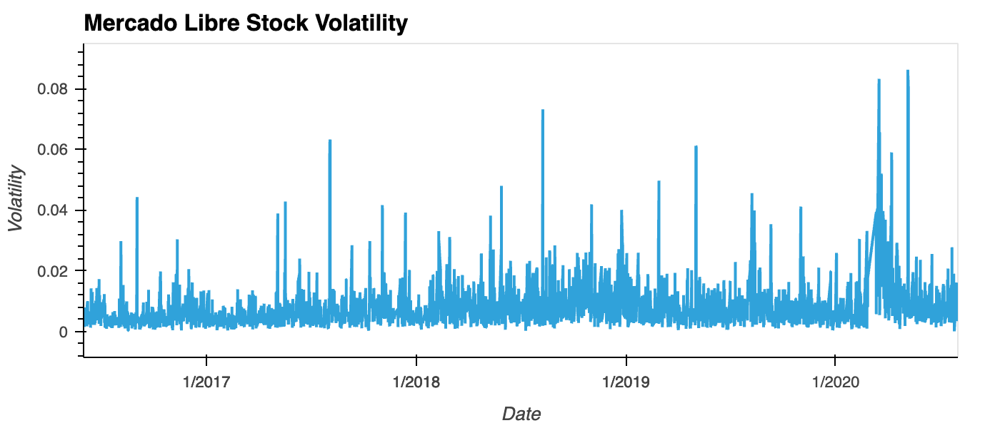

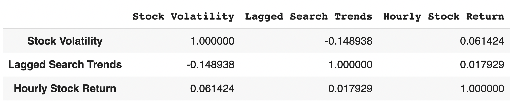

**Does a predictable relationship exist between the lagged search traffic and the stock volatility or between the lagged search traffic and the stock price returns?**

Stock volatility and lagged search traffic are correlated negatively, while hourly stock returns and lagged search traffic are correlated positively.

## Step 4: Create a Time Series Model with Prophet

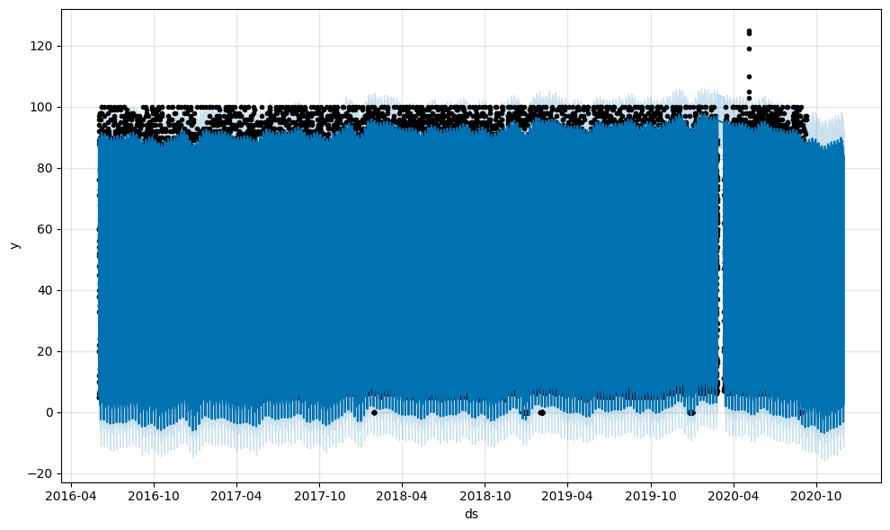

**How's the near-term forecast for the popularity of MercadoLibre?**

The near-term forecast for the popularity of MercadoLibre predicts a negative downward trend.

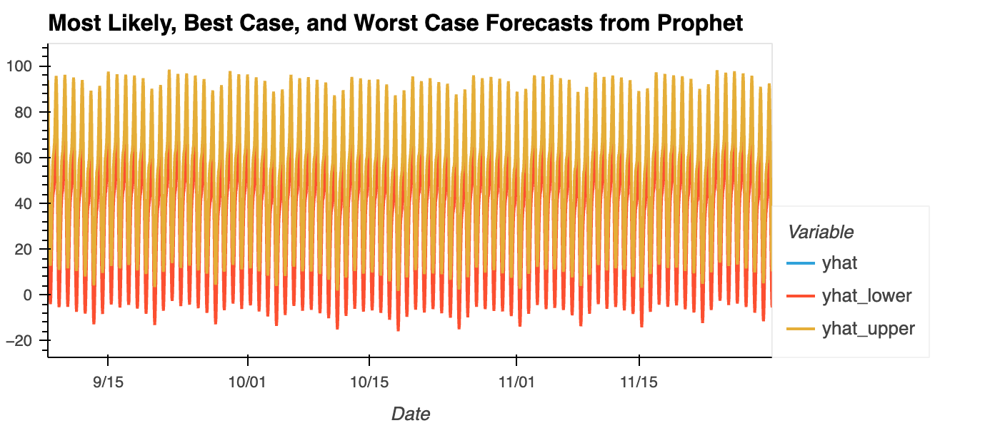

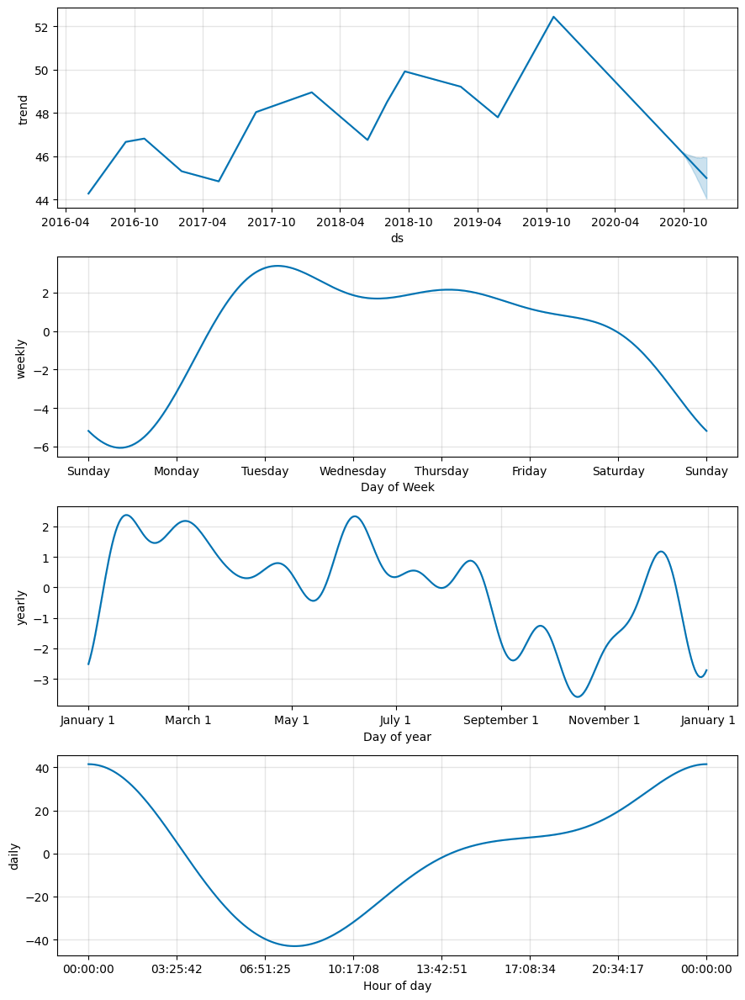

**What time of day exhibits the greatest popularity?**

The time of day that exhibits the greatest popularity is at 0:00:00 at the beginning and ending of the day.

**Which day of week gets the most search traffic?**

Tuesday is the day with the most search traffic.

**What's the lowest point for search traffic in the calendar year?**

The lowest point for the serach traffic in the calendar year is mid-october.

## Step 5 (Optional): Forecast Revenue by Using Time Series Models

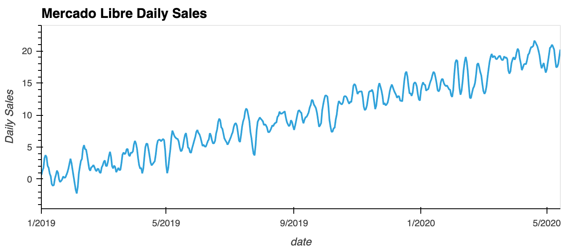

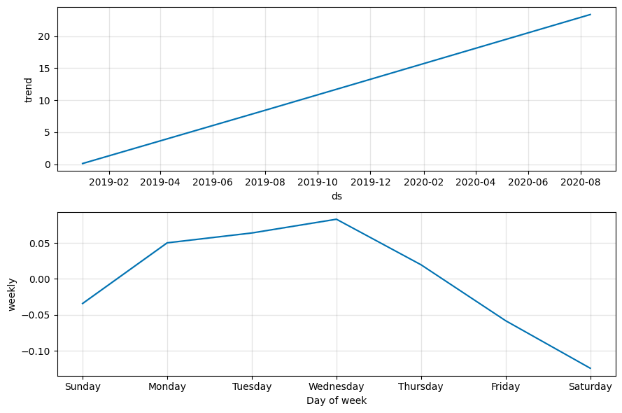

**For example, what are the peak revenue days? (Mondays? Fridays? Something else?)**

The peak revenue days in the week is Wednesday, followed by Monday.

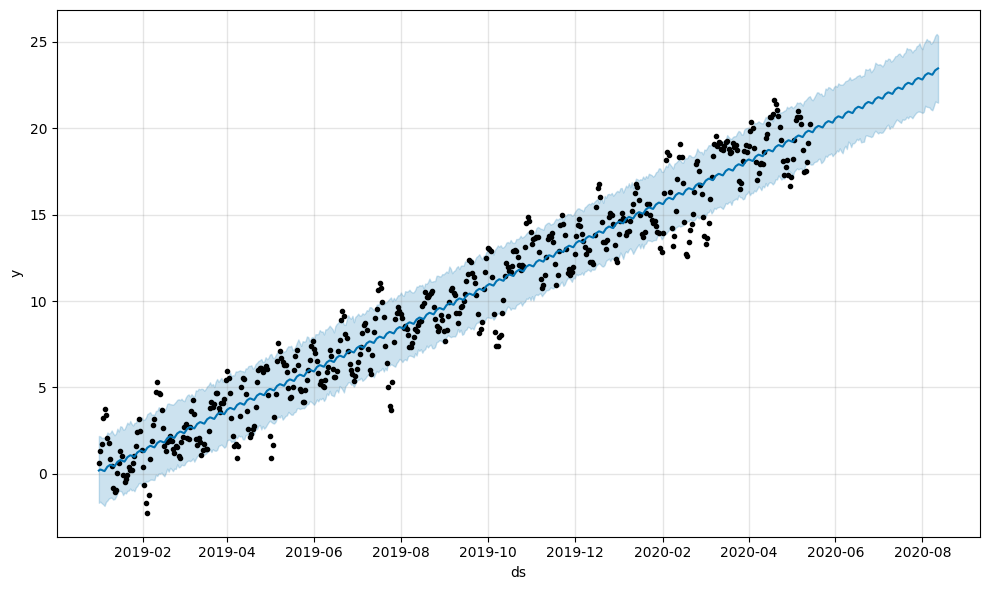

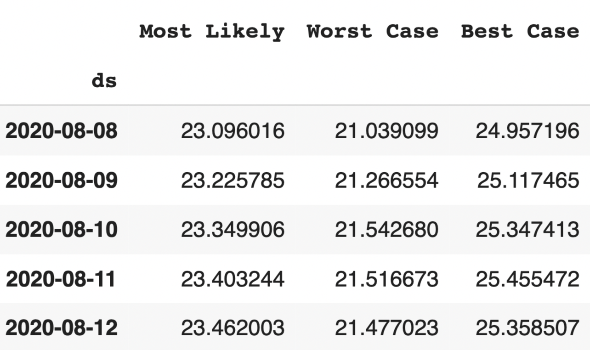

**Based on the forecast information generated above, produce a sales forecast for the finance division, giving them a number for expected total sales next quarter. Include best and worst case scenarios, to better help the finance team plan.**

According to the forecast, the most likely situation is 970, while the best case is 1052 and the worst case is 886.
